# Diagramas de flujo del Manual Operativo - Gratitud Gourmet

**Base:** Manual Operativo Digital por Areas - Gratitud Gourmet  
**Fecha:** 22/06/2026  
**Formato:** Mermaid editable

Este documento contiene un diagrama general del flujo completo del evento y diagramas separados por area para que cada equipo pueda ver su parte del proceso sin mezclar tareas.

---

## 1. Diagrama general del flujo completo

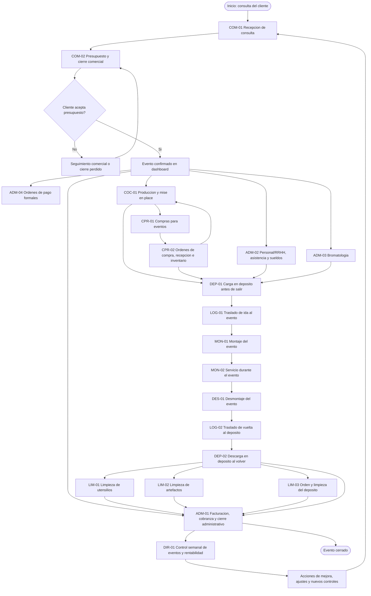

---

## 2. Area Comercial

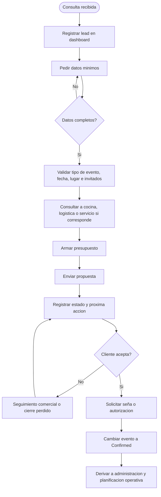

---

## 3. Area Administracion

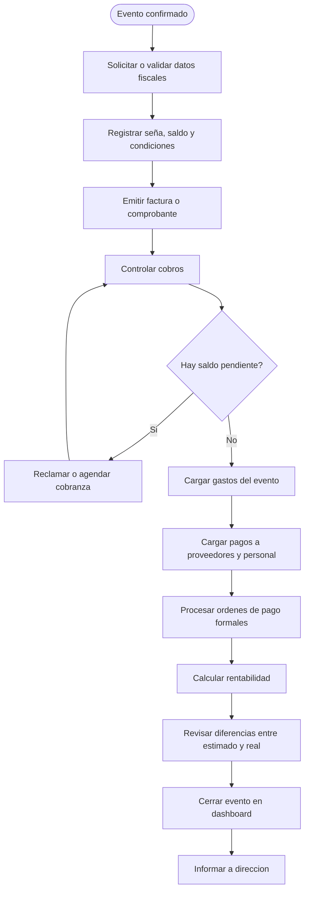

---

## 4. Area Personal / RRHH

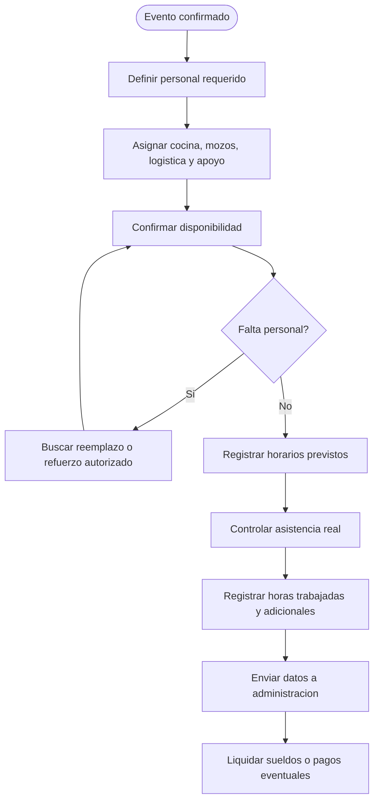

---

## 5. Area Bromatologia / Calidad

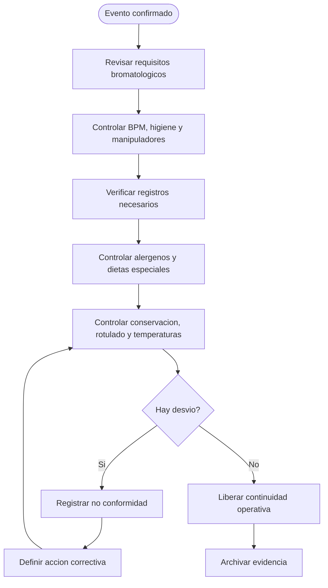

---

## 6. Area Cocina y Produccion

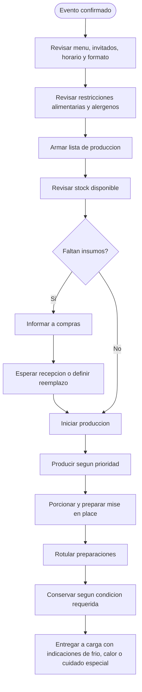

---

## 7. Area Compras y Proveedores

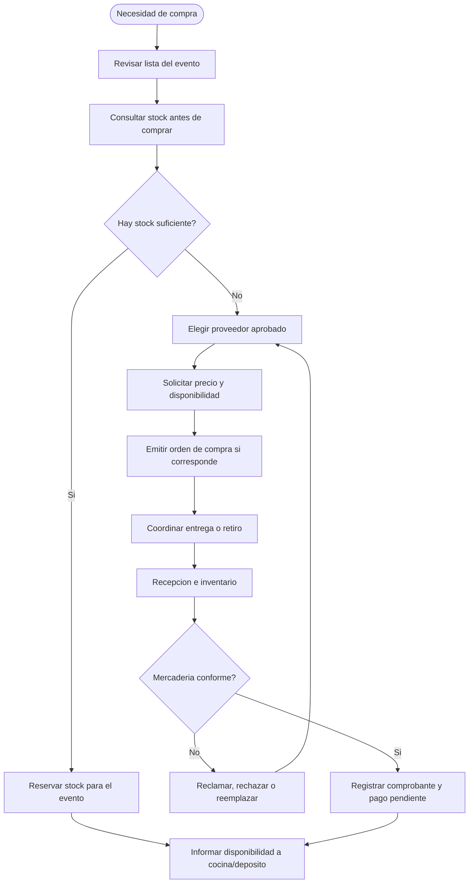

---

## 8. Area Deposito, Stock y Equipamiento

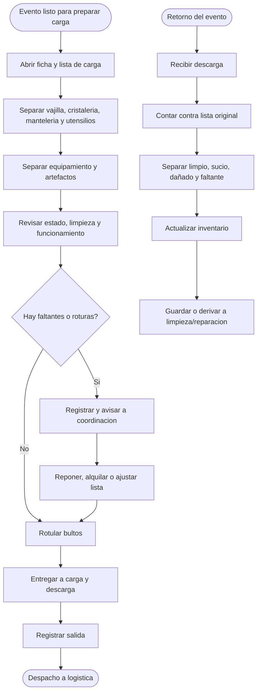

---

## 9. Area Logistica y Traslados

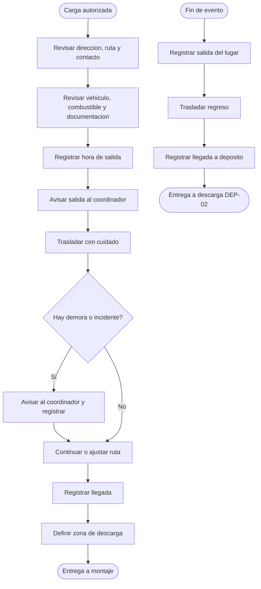

---

## 10. Area Carga y Descarga

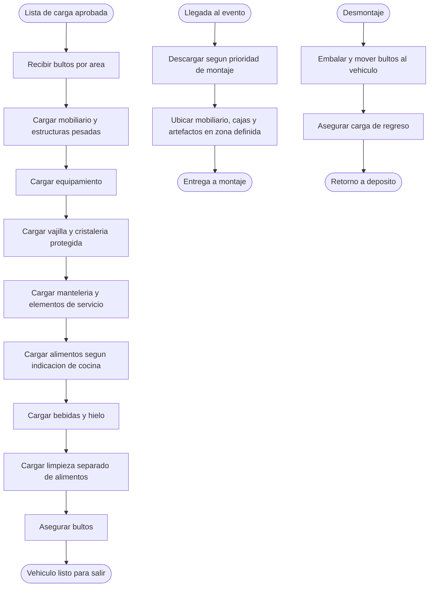

---

## 11. Area Montaje

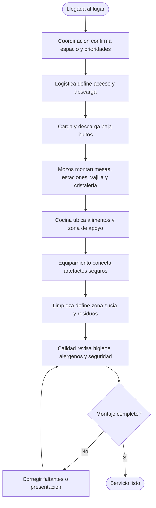

---

## 12. Area Servicio / Mozos

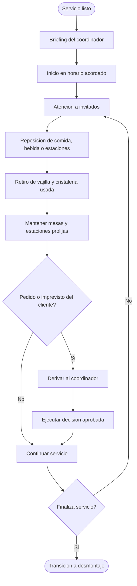

---

## 13. Area Desmontaje y Retorno

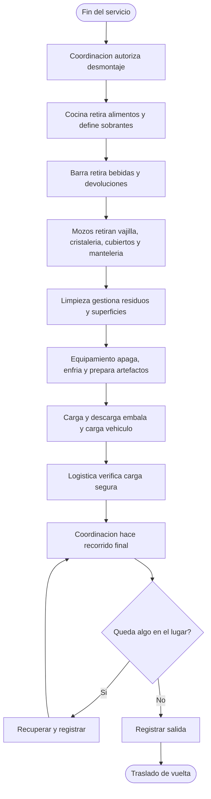

---

## 14. Area Orden, Limpieza y Mantenimiento

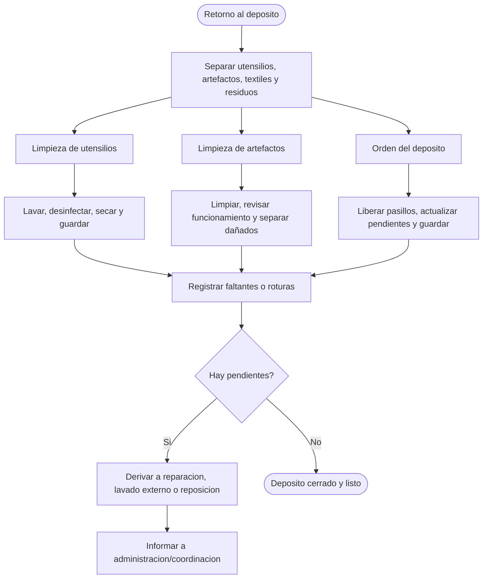

---

## 15. Area Direccion y Control de Gestion

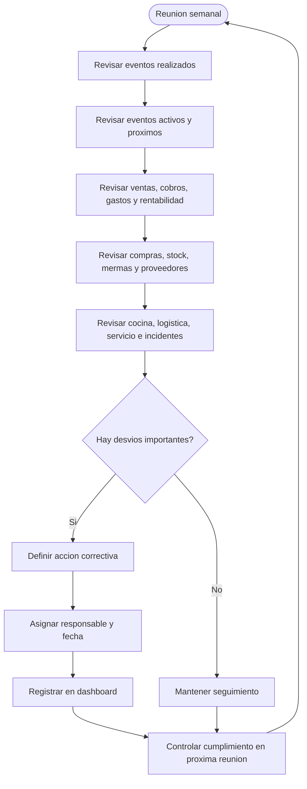

---

## 16. Lectura rapida por responsables

| Responsable | Diagramas clave |
|---|---|
| Comercial | Area Comercial, Diagrama general |
| Administracion | Administracion, Ordenes de pago, Direccion |
| Cocina | Cocina y Produccion, Bromatologia, Desmontaje |
| Compras | Compras y Proveedores, Deposito/Stock |
| Deposito | Deposito/Stock, Carga y Descarga, Limpieza |
| Logistica | Logistica y Traslados, Carga y Descarga |
| Mozos / Servicio | Montaje, Servicio / Mozos, Desmontaje |
| Coordinacion de evento | Diagrama general, Montaje, Servicio, Desmontaje |
| Direccion | Direccion y Control de Gestion, Diagrama general |

